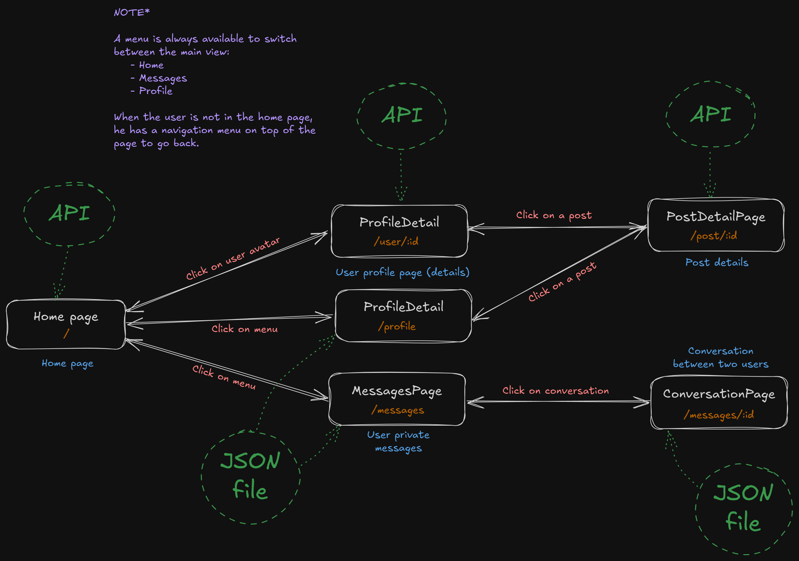

# Pràctica A01 - QuasarApp: Activitat d'investigació

## Instrucions d'ús

Per clonar aquesta branca del repositori cal executar la següent comanda:

```bash
git clone --single-branch --branch a01-quasar-investigacio https://github.com/picuu/m14.git
```

### Com accedir a les activitats?

El repositori conté una branca per cada activitat realitzada. Per accedir a les activitats, cal seleccionar la branca corresponent a l'activitat que es vol consultar.

[Enllaç a la branca principal, amb l'index complert de totes les activitats](https://github.com/picuu/m14?tab=readme-ov-file#branques-per-activitat)

## Manual tècnic

### Descripció dels components de Quasar utilitzats

L'aplicació fa ús de diversos components de Quasar però també de elements HTML natius per crear una interfície d'usuari atractiva i funcional. A continuació es detallen els **components més rellevants**:

#### Components més rellevants

##### Infinite Scroll

El component `Infinite Scroll` de Quasar permet carregar més contingut a mesura que l'usuari es desplaça cap avall en una llista. En aquest cas, s'ha utilitzat per carregar més publicacions A mesura que l'usuari es desplaça per la pàgina principal. S'han utilitzat les props i events següents:

- `@load`: event que s'executa quan l'usuari arriba al final de la llista, per poder carregar més publicacions
- `offset`: per definir la distància en píxels a la qual s'ha de carregar més contingut

Més informació a la [documentació de Quasar](https://quasar.dev/vue-components/infinite-scroll).

##### Avatar & QImg

El component `Avatar` de Quasar permet mostrar imatges d'usuari de manera atractiva i personalitzada. En aquest cas, s'ha utilitzat per mostrar la imatge de perfil de cada usuari a la llista de publicacions, al header de histories i a la pàgina de detall del perfil d'un usuari. S'han utilitzat les props següents:

- `size`: per definir la mida de l'avatar

El component `QImg` de Quasar permet mostrar imatges de manera eficient i optimitzada. En aquest cas, s'ha utilitzat per mostrar les imatges de les publicacions a la pàgina principal i a la pàgina de detall d'una publicació. S'han utilitzat les props següents:

- `src`: per definir la font de la imatge
- `alt`: per definir el text alternatiu de la imatge
- `spinner-color`: per definir el color del carregador de la imatge
- `ratio`: per definir la proporció de la imatge

Aquests dos components s'han utilitzat conjuntament.

Més informació sobre `Avatar` a la [documentació de Quasar](https://quasar.dev/vue-components/avatar).

Més informació sobre `QImg` a la [documentació de Quasar](https://quasar.dev/vue-components/img).

##### Icon

El component `Icon` de Quasar permet mostrar icones de manera personalitzada i de moltes fonts. En aquest cas, s'ha utilitzat per mostrar icones de navegació, de publicacions i d'altres elements de la interfície d'usuari. S'han utilitzat les props següents:

- `name`: per definir el nom de la icona a mostrar (i això pot ser un nom d'icona de la font de Quasar, FontAwesome, Material Icons, etc.)
- `size`: per definir la mida de la icona

Més informació a la [documentació de Quasar](https://quasar.dev/vue-components/icon).

#### Altres components utilitzats

- [Button](https://quasar.dev/vue-components/button)
- [Card](https://quasar.dev/vue-components/card)
- [Tabs](https://quasar.dev/vue-components/tabs)
- [Chat Message](https://quasar.dev/vue-components/chat)
- [Circular Progress](https://quasar.dev/vue-components/circular-progress)
- [Inner Loading](https://quasar.dev/vue-components/inner-loading)
- [List and List Items](https://quasar.dev/vue-components/list-and-list-items)
- [Resize Observer](https://quasar.dev/vue-components/resize-observer)
- [Skeleton](https://quasar.dev/vue-components/skeleton)
- [Slide Item](https://quasar.dev/vue-components/slide-item)
- [Toolbar](https://quasar.dev/vue-components/toolbar)

### Documentació de l'API

L'API pública utilitzada és [Dummy API](https://dummyapi.io/), que proporciona dades fictícies sobre usuaris i publicacions, entre altres, per poder simular una xarxa social.

Per poder utilitzar l'API es necessita una clau d'accés. En aquest cas la clau està pujada al repositori, però en un entorn real no es recomana fer-ho. Aquesta clau o, més ben dit, token d'accés s'ha d'incloure a l'encapçalament de les peticions a l'API. En aquest cas, la clau és `662ce09b690e96c95e7103b4` i s'ha d'incloure en el camp `app-id` dels _headers_ de la petició.

La URL base de l'API és `https://dummyapi.io/data/v1/` i s'ha d'afegir el _endpoint_ corresponent a la petició que es vulgui fer. Per exemple, per obtenir la llista d'usuaris, la URL completa seria `https://dummyapi.io/data/v1/user`.

#### Endpoints utilitzats

- `GET /user`: per obtenir la llista d'usuaris
- `GET /user/:id`: per obtenir la informació d'un usuari concret
- `GET /user/:id/post`: per obtenir la llista de publicacions d'un usuari concret
- `GET /post`: per obtenir la llista de publicacions
- `GET /post/:id`: per obtenir la informació d'una publicació concreta

Les respostes donades per cada enpoint es poden veure a la [secció _Models_ de la documentació de l'API](https://dummyapi.io/docs/models).

Per més informació, veure la [documentació oficial de Dummy API](https://dummyapi.io/docs).

### Explicació del flux de l'aplicació

L'aplicació consta de 6 vistes diferents:

- Pàgina principal
- Pàgina de detall del perfil d'un usuari
- Pàgina del perfil de l'usuari connectat
- Pàgina de detall d'una publicació
- Pàgina de missatges (llistat de conversacions)
- Pàgina d'una conversació entre dos usuaris

L'aplicació té navegació per cambiar entre vistes i tornar enrere.

Les vistes fan ús principalment d'una API pública per obtenir informació d'usuari i publicacions, llevat de la pàgina de missatges i la pàgina de detall d'una conversa, que utilitzen dades "_hardcoded_" o "_mock_" provinents d'un fitxer local.

Per cridar a l'API s'han create diversos composables que encapsulen la lògica de les peticions i la gestió de les dades. Aquests composables es poden reutilitzar en diferents components de l'aplicació.


